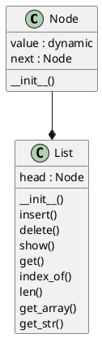

# Linked List クラス図

```plantuml
@startuml
Node --* List

class Node {
  value : dynamic
  next : Node
  __init__()
}

class List {
   head : Node
   __init__()
   insert()
   delete()
   show()
   get()
   index_of()
   len()
   get_array()
   get_str()
}

@enduml
```