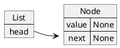
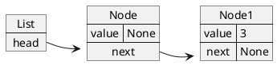
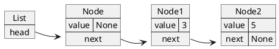
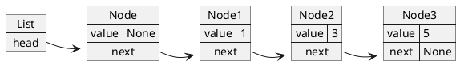

# Object diagram

## LinkedList()

```plantuml
@startuml

map Node {
  value => None
  next => None
}

map List {
  head *-> Node
}

@enduml
```

## l.insert(3)

```plantuml
@startuml

map Node1 {
  value => 3
  next => None
}

map Node {
  value => None
  next *-> Node1
}

map List {
  head *-> Node
}

@enduml
```

## l.insert(5)

```plantuml
@startuml

map Node2 {
  value => 5
  next => None
}

map Node1 {
  value => 3
  next *-> Node2
}

map Node {
  value => None
  next *-> Node1
}

map List {
  head *-> Node
}

@enduml
```

## l.insert(1)

```plantuml
@startuml

map Node3 {
  value => 5
  next => None
}

map Node2 {
  value => 3
  next *-> Node3
}

map Node1 {
  value => 1
  next *-> Node2
}

map Node {
  value => None
  next *-> Node1
}

map List {
  head *-> Node
}

@enduml
```

## l.delete(3)

```plantuml
@startuml

map Node2 {
  value => 5
  next => None
}

map Node1 {
  value => 1
  next *-> Node2
}

map Node {
  value => None
  next *-> Node1
}

map List {
  head *-> Node
}

@enduml
```