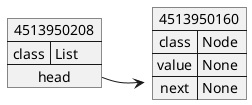
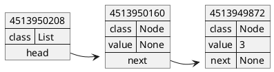
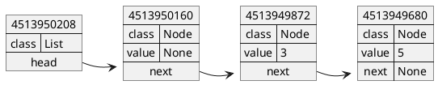
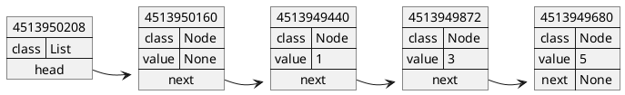

# Object diagram
## LinkedList()

```plantuml
@startuml

map 4513950160 {
    class => Node
    value => None
    next => None
}

map 4513950208 {
    class => List
    head *-> 4513950160
}

@enduml
```

## insert(3)

```plantuml
@startuml

map 4513949872 {
    class => Node
    value => 3
    next => None
}

map 4513950160 {
    class => Node
    value => None
    next *-> 4513949872
}

map 4513950208 {
    class => List
    head *-> 4513950160
}

@enduml
```

## insert(5)

```plantuml
@startuml

map 4513949680 {
    class => Node
    value => 5
    next => None
}

map 4513949872 {
    class => Node
    value => 3
    next *-> 4513949680
}

map 4513950160 {
    class => Node
    value => None
    next *-> 4513949872
}

map 4513950208 {
    class => List
    head *-> 4513950160
}

@enduml
```

## insert(1)

```plantuml
@startuml

map 4513949680 {
    class => Node
    value => 5
    next => None
}

map 4513949872 {
    class => Node
    value => 3
    next *-> 4513949680
}

map 4513949440 {
    class => Node
    value => 1
    next *-> 4513949872
}

map 4513950160 {
    class => Node
    value => None
    next *-> 4513949440
}

map 4513950208 {
    class => List
    head *-> 4513950160
}

@enduml
```

## delete(3)

```plantuml
@startuml

map 4513949680 {
    class => Node
    value => 5
    next => None
}

map 4513949440 {
    class => Node
    value => 1
    next *-> 4513949680
}

map 4513950160 {
    class => Node
    value => None
    next *-> 4513949440
}

map 4513950208 {
    class => List
    head *-> 4513950160
}

@enduml
```