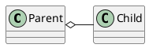
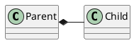
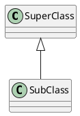

# UML クラス図

## アグリゲーション（集約）

```plantuml
@startuml
Parent o- Child
@enduml
```

## コンポジション（合成集約）

```plantuml
@startuml
Parent *- Child
@enduml
```

## 継承

```plantuml
@startuml
SuperClass <|-- SubClass
@enduml
```