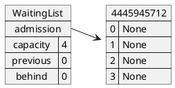
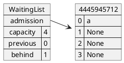
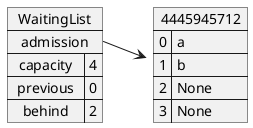
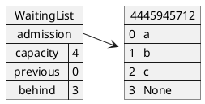
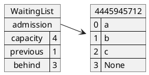

# Object diagram
## WaitingList()

```plantuml
@startuml

map 4445945712 {
    0 => None
    1 => None
    2 => None
    3 => None
}

map WaitingList {
    admission *-> 4445945712
    capacity => 4
    previous => 0
    behind => 0
}

@enduml
```

## q.enqueue("a")

```plantuml
@startuml

map 4445945712 {
    0 => a
    1 => None
    2 => None
    3 => None
}

map WaitingList {
    admission *-> 4445945712
    capacity => 4
    previous => 0
    behind => 1
}

@enduml
```

## q.enqueue("b")

```plantuml
@startuml

map 4445945712 {
    0 => a
    1 => b
    2 => None
    3 => None
}

map WaitingList {
    admission *-> 4445945712
    capacity => 4
    previous => 0
    behind => 2
}

@enduml
```

## q.enqueue("c")

```plantuml
@startuml

map 4445945712 {
    0 => a
    1 => b
    2 => c
    3 => None
}

map WaitingList {
    admission *-> 4445945712
    capacity => 4
    previous => 0
    behind => 3
}

@enduml
```

## q.dequeue()

```plantuml
@startuml

map 4445945712 {
    0 => a
    1 => b
    2 => c
    3 => None
}

map WaitingList {
    admission *-> 4445945712
    capacity => 4
    previous => 1
    behind => 3
}

@enduml
```

## q.dequeue()

```plantuml
@startuml

map 4445945712 {
    0 => a
    1 => b
    2 => c
    3 => None
}

map WaitingList {
    admission *-> 4445945712
    capacity => 4
    previous => 2
    behind => 3
}

@enduml
```

## q.dequeue()

```plantuml
@startuml

map 4445945712 {
    0 => a
    1 => b
    2 => c
    3 => None
}

map WaitingList {
    admission *-> 4445945712
    capacity => 4
    previous => 3
    behind => 3
}

@enduml
```