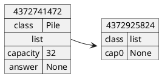
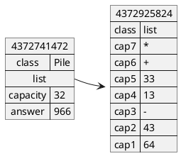
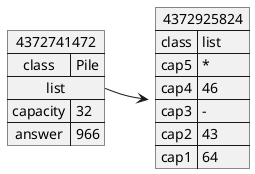
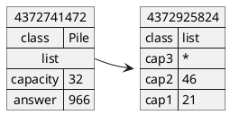

# Object diagram
## Pile()

```plantuml
@startuml

map 4372925824 {
    class => list
    cap0 => None
}

map 4372741472 {
    class => Pile
    list *-> 4372925824
    capacity => 32
    answer => None
}

@enduml
```

## input 64 43 - 13 33 + *

```plantuml
@startuml

map 4372925824 {
    class => list
    cap7 => *
    cap6 => +
    cap5 => 33
    cap4 => 13
    cap3 => -
    cap2 => 43
    cap1 => 64
}

map 4372741472 {
    class => Pile
    list *-> 4372925824
    capacity => 32
    answer => 966
}

@enduml
```

64 43 - 46 *

```plantuml
@startuml

map 4372925824 {
    class => list
    cap5 => *
    cap4 => 46
    cap3 => -
    cap2 => 43
    cap1 => 64
}

map 4372741472 {
    class => Pile
    list *-> 4372925824
    capacity => 32
    answer => 966
}

@enduml
```

21 46 *

```plantuml
@startuml

map 4372925824 {
    class => list
    cap3 => *
    cap2 => 46
    cap1 => 21
}

map 4372741472 {
    class => Pile
    list *-> 4372925824
    capacity => 32
    answer => 966
}

@enduml
```