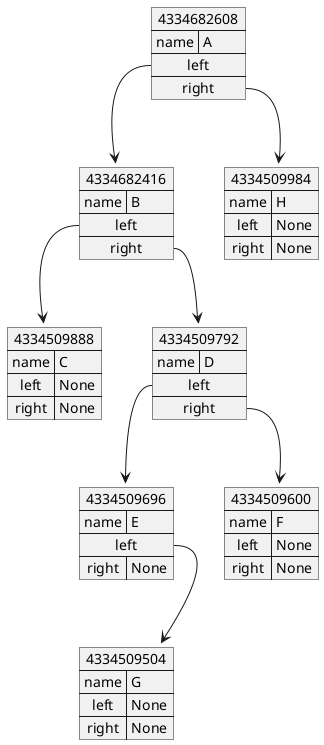

## binary_tree

```plantuml
@startuml

map 4334509888 {
    name => C
    left => None
    right => None
}

map 4334509504 {
    name => G
    left => None
    right => None
}

map 4334509696 {
    name => E
    left *--> 4334509504
    right => None
}

map 4334509600 {
    name => F
    left => None
    right => None
}

map 4334509792 {
    name => D
    left *--> 4334509696
    right *--> 4334509600
}

map 4334682416 {
    name => B
    left *--> 4334509888
    right *--> 4334509792
}

map 4334509984 {
    name => H
    left => None
    right => None
}

map 4334682608 {
    name => A
    left *--> 4334682416
    right *--> 4334509984
}

@enduml
```