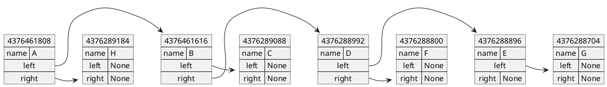

## binary_tree

```plantuml
@startuml

map 4376289088 {
    name => C
    left => None
    right => None
}

map 4376288704 {
    name => G
    left => None
    right => None
}

map 4376288896 {
    name => E
    left *-> 4376288704
    right => None
}

map 4376288800 {
    name => F
    left => None
    right => None
}

map 4376288992 {
    name => D
    left *-> 4376288896
    right *-> 4376288800
}

map 4376461616 {
    name => B
    left *-> 4376289088
    right *-> 4376288992
}

map 4376289184 {
    name => H
    left => None
    right => None
}

map 4376461808 {
    name => A
    left *-> 4376461616
    right *-> 4376289184
}

@enduml
```
